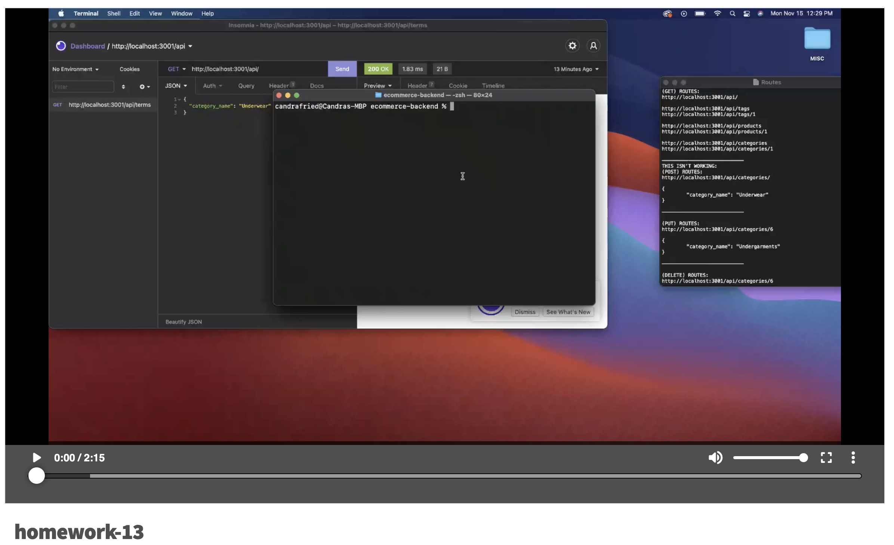

# Ecommerce Backend


## Description
This application creates the back end for an e-commerce site by modifying starter code.

## Table of Contents
- [Important URLs](#urls)
- [Foreword](#foreword)
- [Usage](#usage)
- [User Story](#user-story)
- [Acceptance Criteria](#acceptance-criteria)
- [Mockup](#mock-up)
- [Frameworks](#frameworks)
- [License](#Licensing)

## URLs
- [GitHub Repo URL](https://github.com/candracodes/ecommerce-backend)
- [Walk Through Video](https://watch.screencastify.com/v/7SxtzgRgxpm9KgNw4la9)
- [Full Acceptance Criteria](./assets/README.md)

## Usage
- To start this application, the user must `SOURCE` the db/schema.sql, then run `npm run seed`, and finally, `node server.js` into the command line

## User-Story

```md
AS A manager at an internet retail company
I WANT a back end for my e-commerce website that uses the latest technologies
SO THAT my company can compete with other e-commerce companies
```

## Acceptance-Criteria

```md
GIVEN a functional Express.js API
WHEN I add my database name, MySQL username, and MySQL password to an environment variable file
THEN I am able to connect to a database using Sequelize
WHEN I enter schema and seed commands
THEN a development database is created and is seeded with test data
WHEN I enter the command to invoke the application
THEN my server is started and the Sequelize models are synced to the MySQL database
WHEN I open API GET routes in Insomnia Core for categories, products, or tags
THEN the data for each of these routes is displayed in a formatted JSON
WHEN I test API POST, PUT, and DELETE routes in Insomnia Core
THEN I am able to successfully create, update, and delete data in my database
```

## Mock-Up

* This application should resemble the following screenshots and video example:

[](https://watch.screencastify.com/v/7SxtzgRgxpm9KgNw4la9)

## Frameworks

The project is created using the following frameworks and packages

- [Node.JS](https://nodejs.org/en/)
- [MySQL2](https://www.npmjs.com/package/mysql2)
- [Sequelize](https://www.npmjs.com/package/sequelize)
- [DOTENV](https://www.npmjs.com/package/dotenv)

## Licensing
The project is made possible with the following Licensing:
- [MIT](license.txt)


